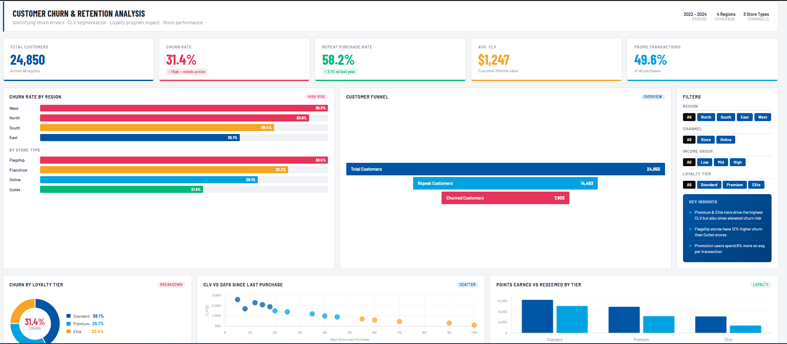

# Customer Churn Analysis
This project analyzes customer churn behavior using data analysis and visualization techniques. The goal is to understand why customers leave and identify patterns that can help improve retention.
---
## Dashboard Preview

---
## Tools Used
- Python (Pandas, NumPy)
- Power BI
- SQL

---

## What I did
- Cleaned and prepared customer dataset  
- Analyzed churn patterns across demographics and usage  
- Created KPIs like churn rate and retention rate  
- Built a Power BI dashboard to visualize customer behavior  

---

## Key Insights
- Customers with lower engagement were more likely to churn  
- Certain customer segments had higher churn rates  
- Usage patterns strongly influenced retention  

